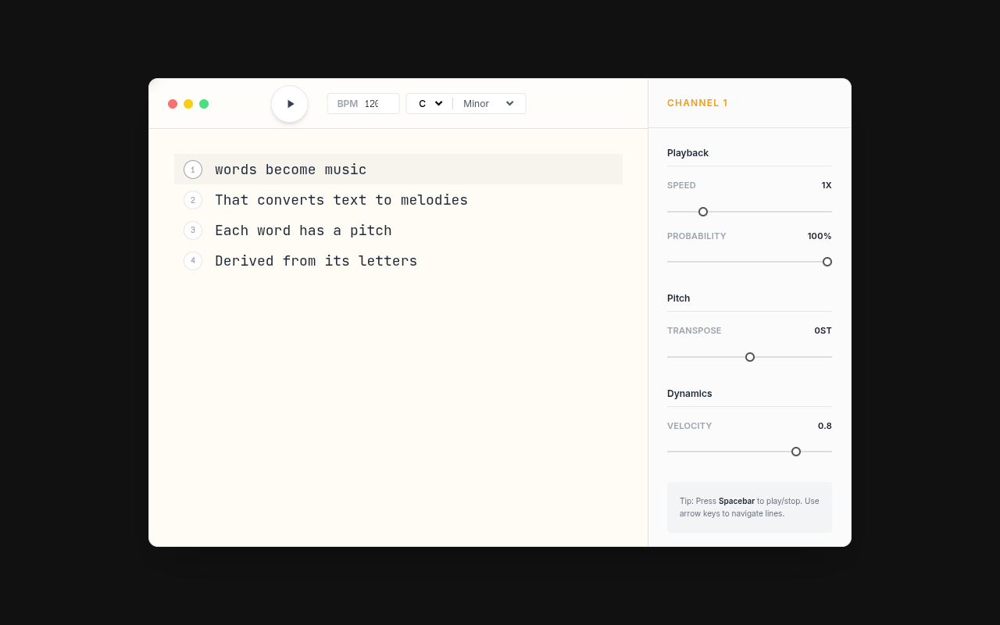

# WORDS | Text-to-MIDI

A React one-pager that turns typed words into melodies: each word's letters are mapped to notes in the selected scale, with controls for root note, scale, transposition, and tempo. Playback runs through Web Audio.

**Live:** https://razodin137.github.io/words-midi/

